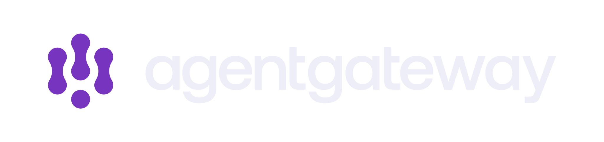
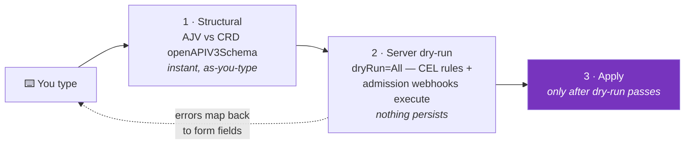
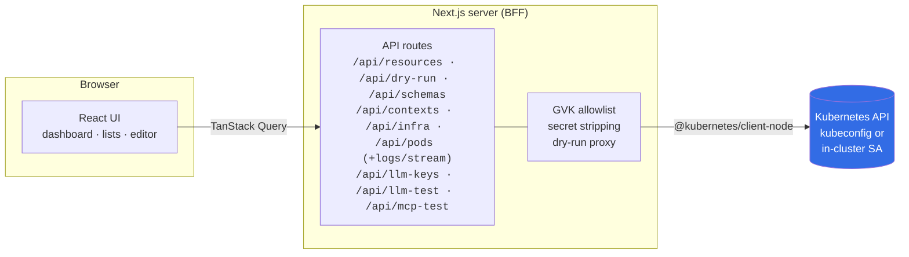

<div align="center">

<picture>
  <source media="(prefers-color-scheme: dark)" srcset="public/banner-dark.svg">
  <source media="(prefers-color-scheme: light)" srcset="public/banner-light.svg">
  
</picture>

# agentgateway console

**Kubernetes clickops for [agentgateway](https://agentgateway.dev)** — dashboards, resource browsing, and fully validated create / edit / delete for everything you'd otherwise manage with `kubectl apply`.

[](LICENSE)
[](https://nextjs.org)
[](https://react.dev)
[](https://www.typescriptlang.org)
[](https://gateway-api.sigs.k8s.io)
[](https://github.com/kevin-shelaga/agentgateway-console/actions/workflows/ci.yml)
[](https://github.com/kevin-shelaga/agentgateway-console/actions/workflows/kind-e2e.yml)
[](https://github.com/kevin-shelaga/agentgateway-console/actions/workflows/container.yml)

[Features](#-features) · [Compatibility](#-version-compatibility) · [Quickstart](#-quickstart) · [Deployment](#-deployment) · [Architecture](#-architecture) · [Development](#-development) · [Releasing](#-releasing)

</div>

---

## Why this exists

The [agentgateway](https://github.com/agentgateway/agentgateway) project ships a UI for its standalone (file-config) mode, but the **Kubernetes deployment mode** — driven by Gateway API resources plus the `agentgateway.dev` CRDs — has been kubectl-only. This console fills that gap: a purpose-built control panel for every kind that defines an agentgateway deployment — Gateway API, agentgateway.dev, and the Solo enterprise groups, with validation driven by the CRDs themselves so the UI can never drift from the API.

## 📦 What it manages

| Kind | API group | Purpose |
|---|---|---|
| `GatewayClass` | `gateway.networking.k8s.io/v1` | Gateway implementations + parameters |
| `Gateway` | `gateway.networking.k8s.io/v1` | Listeners, ports, TLS |
| `ListenerSet` | `gateway.networking.k8s.io/v1` | Extra listeners attached to a parent gateway |
| `HTTPRoute` | `gateway.networking.k8s.io/v1` | HTTP routing rules |
| `GRPCRoute` | `gateway.networking.k8s.io/v1` | gRPC routing rules |
| `TLSRoute` | `gateway.networking.k8s.io/v1` | SNI-based TLS passthrough routing |
| `BackendTLSPolicy` | `gateway.networking.k8s.io/v1` | TLS verification for gateway → backend connections |
| `ReferenceGrant` | `gateway.networking.k8s.io/v1` | Cross-namespace reference permissions |
| `AgentgatewayBackend` | `agentgateway.dev/v1alpha1` | AI/LLM providers, MCP servers, static upstreams |
| `AgentgatewayPolicy` | `agentgateway.dev/v1alpha1` | Traffic / frontend / backend policy attachment |
| `AgentgatewayParameters` | `agentgateway.dev/v1alpha1` | Data plane deployment settings |
| `EnterpriseAgentgatewayBackend` | `enterpriseagentgateway.solo.io/v1alpha1` | Enterprise backends incl. `entMcp` tool modes |
| `EnterpriseAgentgatewayPolicy` | `enterpriseagentgateway.solo.io/v1alpha1` | Enterprise policies (extAuth, rate limiting, CSRF, extProc, …) |
| `EnterpriseAgentgatewayParameters` | `enterpriseagentgateway.solo.io/v1alpha1` | Data plane settings + shared extensions (extauth/ratelimiter/extCache) |
| `EnterpriseListenerSet` | `enterprise.solo.io/v1alpha1` | Enterprise listener sets |

> [!NOTE]
> Namespaces, Services, and Secrets are read **names-only** to power picker dropdowns — secret payloads never leave the server. Pods (and their logs) are readable only for agentgateway proxy / control-plane pods, enforced by a label scope guard in the BFF.

### Enterprise install

The four `solo.io` kinds get their own **Enterprise** sidebar group and participate everywhere the OSS kinds do: dashboard tiles and breakdowns, completeness checks, the playground pickers, route `backendRefs` / policy `targetRefs` selectors, the API-key "referenced by" join, and the reference graph. On clusters **without** the enterprise CRDs everything degrades gracefully — lists show a "CRD not installed" state and dashboard/playground queries treat the missing kinds as empty. Enterprise schemas are bundled from a sibling `agentgateway-enterprise` checkout when present (`node scripts/extract-schemas.mjs` skips them otherwise).

## 🧭 Version compatibility

| Component | Supported | Notes |
|---|---|---|
| [agentgateway](https://github.com/agentgateway/agentgateway) | **v1.0.0+** | Every release since v1.0.0 ships the `agentgateway.dev/v1alpha1` CRDs the console manages |
| [Gateway API](https://gateway-api.sigs.k8s.io) | **v1.1+** (v1.5.x recommended) | The console prefers `v1` and **negotiates older served versions per CRD** (e.g. `TLSRoute v1alpha3`, `ReferenceGrant v1beta1`), so mixed-version clusters work. agentgateway itself installs and tests against 1.5.x |
| Kubernetes | Whatever your Gateway API release supports | Upstream Gateway API supports the [five most recent Kubernetes minors](https://gateway-api.sigs.k8s.io/concepts/versioning/). The console itself only needs CRD reads and server-side dry-run |
| Node.js (local dev) | **20+** | The Docker image runs Node 22 |
| [agentgateway-enterprise](https://docs.solo.io/agentgateway/) | optional | Enterprise kinds appear automatically when the `solo.io` CRDs are installed; absent CRDs degrade to a "not installed" state |

The console is deliberately **version-tolerant**: validation schemas are read live from the CRDs installed in your cluster, so when a new agentgateway release adds fields, the editor and validation pick them up immediately — no console upgrade needed. The bundled fallback schemas (used only when the cluster can't serve CRDs) currently track agentgateway and agentgateway-enterprise `main` as of 2026-06-11; refresh them anytime with `node scripts/extract-schemas.mjs`.

> [!IMPORTANT]
> The `agentgateway.dev` API group is still **v1alpha1** — breaking changes upstream are possible between agentgateway minor versions. Because schemas are cluster-sourced, the YAML editor and validation will follow such changes automatically, but the guided forms cover the spec as of the bundled snapshot; anything newer is still editable through YAML.

## ✨ Features

- 📊 **Dashboard** — gateway fleet health from status conditions, runtime pods with live CPU/memory sparklines, backend/policy/protocol/AI-provider breakdowns, and a "needs attention" triage list mixing condition failures with **configuration completeness checks** (routes → missing gateways/backends, orphaned backends, dangling policy targets — things controllers never report).
- 🗂️ **List & detail pages** — namespace filter, text search, **click-to-sort columns and faceted value filters**, status badges, condition timelines, and a resolved reference graph (which routes attach to a gateway, which policies target what).
- ✏️ **Split form ⇄ YAML editor** — guided forms for every OSS kind, a schema-aware CodeMirror YAML editor for 100% of the spec. Both edit the same document, synced live in both directions.
- 🛡️ **Three-layer validation, driven by the CRDs themselves** — structural errors as you type, CEL and admission webhook errors before anything persists (see [How validation works](#how-validation-works)).
- 🧪 **Playground** — send a real chat completion (LLM tab) or connect, list tools, and call them over MCP Streamable HTTP (MCP tab) **through the actual gateway**, with endpoints auto-discovered from the backend → route → gateway → address graph.
- 🔑 **API key management** — LLM credentials as `Opaque` Secrets with an `Authorization` entry (the format `spec.policies.auth.secretRef` consumes): create with a crypto-random `sk_…` generator, rotate, delete, see which backends reference each key. Values are write-only — never displayed, returned, or logged after creation.
- 📈 **Pod detail pages** — click any runtime pod for CPU/memory area charts with labeled scales and request/limit reference lines, plus **live log tailing** over a chunked follow stream (container picker, tail size, auto-reconnect, download).
- 🏢 **Enterprise support** — the `solo.io` kinds managed side by side with OSS (see [Enterprise install](#enterprise-install)).
- 🔄 **Kubeconfig context switcher** — operate any cluster your kubeconfig can reach from the widget at the bottom of the sidebar; in-cluster deployments are hard-locked to their own cluster for isolation.
- 🧭 **Served-version negotiation** — clusters skew Gateway API versions (e.g. `TLSRoute v1alpha3`, `ReferenceGrant v1beta1`); the BFF reads each CRD's served versions and aligns reads, writes, and schemas automatically.
- 🌙 **Dark-mode-first UI** — agentgateway brand identity on shadcn/ui primitives, with a light theme one toggle away.

### How validation works

Every save passes through three gates, in order — the first two are free to fail, the cluster only ever sees valid writes:



Schemas are read live from the cluster's installed CRDs, with bundled fallbacks when the cluster is unreachable or the CRDs aren't installed yet.

## 🚀 Quickstart

**Prerequisites:** Node.js 20+ and a kubeconfig (`~/.kube/config`) pointing at a cluster — ideally one with the [agentgateway](https://github.com/agentgateway/agentgateway) and [Gateway API](https://gateway-api.sigs.k8s.io) CRDs installed.

```bash
npm install
npm run dev          # → http://localhost:3000
```

That's it. The server-side API routes load your default kubeconfig; switch contexts from the widget at the bottom of the sidebar.

### CLI

The repo ships a launcher (`bin` of the npm package) that builds once, serves the production bundle on **loopback only** (it holds your kubeconfig credentials), and opens the browser:

```bash
npx agentgateway-console                       # from the repo: npx .
npx agentgateway-console -p 4000 -c my-context # pick port + starting context
npx agentgateway-console --kubeconfig ~/.kube/staging --no-open
```

### Demo environment

No cluster handy? The repo ships a self-contained demo — a kind cluster with agentgateway, a Gateway/HTTPRoutes, two AI backends wired to a mock LLM (randomized token counts), and a traffic generator so every page of the console has live data. Requires `docker`, `kind`, `kubectl`, and `helm`:

```bash
make demo-up        # cluster + agentgateway + demo app
make demo-traffic   # send mixed traffic for ~5 min (Usage page lights up in ~30s)
make demo-console   # console on the kind context
make demo-down      # tear down
```

See [`demo/README.md`](demo/README.md) for details and knobs.

### Configuration

| Variable | Default | Effect |
|---|---|---|
| `KUBECONFIG` | `~/.kube/config` | Standard kubeconfig path override |
| `AGC_CONTEXT` | kubeconfig default | Start on a specific kubeconfig context |
| `AGC_IN_CLUSTER` | auto-detected | Force in-cluster mode (normally detected via `KUBERNETES_SERVICE_HOST`) |
| `PORT` | `3000` | Server port (production / Docker) |

## ☸️ Deployment

### Helm (recommended)

The chart deploys one console per cluster, **hard-locked to that cluster** — the context switcher is removed and the context header is ignored server-side. Released versions are published as OCI artifacts to ghcr alongside the container image:

```bash
helm install console oci://ghcr.io/kevin-shelaga/charts/agentgateway-console \
  --version 0.1.0 -n agentgateway-system --create-namespace
kubectl -n agentgateway-system port-forward svc/console-agentgateway-console 3000:80
```

From a source checkout, the local chart works the same way: `helm install console ./charts/agentgateway-console …`

The Service is `ClusterIP` by default — no external exposure. An Ingress template exists but is disabled; if you enable it, put authentication in front (see the warning below). RBAC (least-privilege ClusterRole) and the ServiceAccount are created by the chart; set `rbac.create=false` / `serviceAccount.create=false` to bring your own.

### Docker

The multi-stage [`Dockerfile`](Dockerfile) builds a minimal standalone server running as a non-root user:

Published images are available from GitHub Container Registry:

```bash
docker run -p 3000:3000 -v ~/.kube:/home/agc/.kube:ro ghcr.io/kevin-shelaga/agentgateway-console:latest
```

```bash
docker build -t agentgateway-console .
docker run -p 3000:3000 -v ~/.kube:/home/agc/.kube:ro agentgateway-console
```

> [!TIP]
> If your kubeconfig points at `localhost` (kind, minikube, k3d), the container can't reach it through the bridge network — add `--network host` on Linux, or deploy in-cluster instead.

### In-cluster

When `KUBERNETES_SERVICE_HOST` is set, the BFF automatically uses the pod's ServiceAccount and locks itself to the surrounding cluster (no context switching). The Helm chart's [`rbac.yaml`](charts/agentgateway-console/templates/rbac.yaml) is the canonical, always-current permission set; the example below mirrors it for raw-manifest installs:

<details>
<summary><b>Example RBAC + Deployment manifest</b></summary>

```yaml
apiVersion: v1
kind: ServiceAccount
metadata:
  name: agentgateway-console
  namespace: agentgateway-system
---
apiVersion: rbac.authorization.k8s.io/v1
kind: ClusterRole
metadata:
  name: agentgateway-console
rules:
  # Managed kinds — full read/write
  - apiGroups: ["gateway.networking.k8s.io"]
    resources: ["gatewayclasses", "gateways", "listenersets", "httproutes",
                "grpcroutes", "tlsroutes", "backendtlspolicies", "referencegrants"]
    verbs: ["get", "list", "create", "update", "delete"]
  - apiGroups: ["agentgateway.dev"]
    resources: ["agentgatewaybackends", "agentgatewaypolicies", "agentgatewayparameters"]
    verbs: ["get", "list", "create", "update", "delete"]
  # Enterprise (no-op without the CRDs)
  - apiGroups: ["enterpriseagentgateway.solo.io"]
    resources: ["enterpriseagentgatewaybackends", "enterpriseagentgatewaypolicies",
                "enterpriseagentgatewayparameters"]
    verbs: ["get", "list", "create", "update", "delete"]
  - apiGroups: ["enterprise.solo.io"]
    resources: ["enterpriselistenersets"]
    verbs: ["get", "list", "create", "update", "delete"]
  # Pickers + API keys (secret payloads never leave the server)
  - apiGroups: [""]
    resources: ["namespaces", "services", "secrets"]
    verbs: ["get", "list", "create", "update", "delete"]
  # Runtime panel + pod pages: agentgateway pods, usage, logs
  - apiGroups: [""]
    resources: ["pods", "pods/log"]
    verbs: ["get", "list"]
  - apiGroups: ["metrics.k8s.io"]
    resources: ["pods"]
    verbs: ["get", "list"]
  # Live CRD schemas + served-version negotiation
  - apiGroups: ["apiextensions.k8s.io"]
    resources: ["customresourcedefinitions"]
    verbs: ["get"]
---
apiVersion: rbac.authorization.k8s.io/v1
kind: ClusterRoleBinding
metadata:
  name: agentgateway-console
roleRef:
  apiGroup: rbac.authorization.k8s.io
  kind: ClusterRole
  name: agentgateway-console
subjects:
  - kind: ServiceAccount
    name: agentgateway-console
    namespace: agentgateway-system
---
apiVersion: apps/v1
kind: Deployment
metadata:
  name: agentgateway-console
  namespace: agentgateway-system
spec:
  replicas: 1
  selector:
    matchLabels: { app: agentgateway-console }
  template:
    metadata:
      labels: { app: agentgateway-console }
    spec:
      serviceAccountName: agentgateway-console
      containers:
        - name: console
          image: agentgateway-console:latest
          ports:
            - containerPort: 3000
---
apiVersion: v1
kind: Service
metadata:
  name: agentgateway-console
  namespace: agentgateway-system
spec:
  selector: { app: agentgateway-console }
  ports:
    - port: 80
      targetPort: 3000
```

</details>

> [!WARNING]
> The console performs no authentication of its own — it acts with the full power of its kubeconfig identity or ServiceAccount. Don't expose it publicly; put it behind your ingress auth, `kubectl port-forward`, or a VPN.

## 🏗 Architecture

A single Next.js app in three layers — the browser never talks to the Kubernetes API directly:



The UI is **registry-driven**: one descriptor per kind supplies columns, status extraction, reference resolution, and templates — so list, detail, and edit pages are fully generic, and only the guided forms are kind-specific.

| Module | Role |
|---|---|
| [`src/lib/registry.ts`](src/lib/registry.ts) | One descriptor per kind — drives the generic list/detail/edit pages |
| [`src/lib/conditions.ts`](src/lib/conditions.ts) | Flattens Gateway listener + route parent conditions into a health summary |
| [`src/lib/validation.ts`](src/lib/validation.ts) | AJV over CRD schemas (the structural layer; CEL runs server-side via dry-run) |
| [`src/lib/k8s/`](src/lib/k8s) | Kubeconfig/in-cluster client factory, typed K8s error parsing |
| [`src/components/editor/resource-editor.tsx`](src/components/editor/resource-editor.tsx) | Split form/YAML editor and the dry-run-gated save pipeline |
| [`src/lib/insights.ts`](src/lib/insights.ts) | Cross-resource completeness checks + dashboard aggregations |
| [`src/lib/llm-endpoints.ts`](src/lib/llm-endpoints.ts) | Backend → route → gateway endpoint discovery for the playground |
| [`src/lib/metrics-history.ts`](src/lib/metrics-history.ts) | Session-wide usage history feeding sparklines and pod charts |
| [`src/components/forms/`](src/components/forms) | Guided forms for every editable kind |
| [`src/app/api/`](src/app/api) | The BFF: resource CRUD, dry-run, schemas, contexts, infra/pods/logs, LLM keys, LLM/MCP test proxies |

## 🛠 Development

```bash
npm run dev      # dev server with hot reload
npm test         # vitest unit tests
npm run build    # production build (standalone output)
npm run test:e2e # Playwright smoke tests against the built CLI server
npm start        # serve the production build

node scripts/extract-schemas.mjs   # refresh bundled CRD schema fallbacks
```

Pull requests run unit coverage, a production build, Playwright smoke e2e, and a Docker build smoke test in GitHub Actions. A separate kind e2e workflow creates a local kind cluster in CI and runs:

```bash
npm run test:e2e:kind
```

The kind workflow runs on `main`, manual dispatch, and same-repository pull requests. Forked pull requests skip it because the test job creates a Kubernetes cluster and exercises the local kubeconfig path.

Built with [Next.js 16](https://nextjs.org) (App Router) · [React 19](https://react.dev) · [Tailwind CSS 4](https://tailwindcss.com) · [shadcn/ui](https://ui.shadcn.com) · [CodeMirror 6](https://codemirror.net) · [TanStack Query](https://tanstack.com/query) · [AJV](https://ajv.js.org) · [@kubernetes/client-node](https://github.com/kubernetes-client/javascript).

Design docs live in [`docs/superpowers/`](docs/superpowers) — the [design spec](docs/superpowers/specs/2026-06-10-agentgateway-console-design.md) is the best place to start for scope and rationale.

## 🚢 Releasing

Releases publish three artifacts, plus a GitHub Release with the validated tarballs and checksums attached:

- `ghcr.io/kevin-shelaga/agentgateway-console` for container deployments.
- `oci://ghcr.io/kevin-shelaga/charts/agentgateway-console` for `helm install`.
- `agentgateway-console` on npm for `npx agentgateway-console`.

Release flow from an up-to-date `main` branch:

```bash
npm version patch
VERSION="v$(node -p "require('./package.json').version")"
git push origin main
git push origin "$VERSION"
```

Publishing is handled by GitHub Actions. Strict semver tags (`vX.Y.Z`) from `main` publish the npm package and tag the container image as `vX.Y.Z` and `latest`. Manual release validation is available from the workflow, but does not publish without a trusted tag or release context. npm publishing uses provenance (`--provenance`) and requires the repository `NPM_TOKEN` secret plus `id-token: write` permission in the release workflow.

## 📄 License

[Apache-2.0](LICENSE) — same as agentgateway. Brand assets (logo, banner) belong to the [agentgateway](https://github.com/agentgateway/agentgateway) project.
